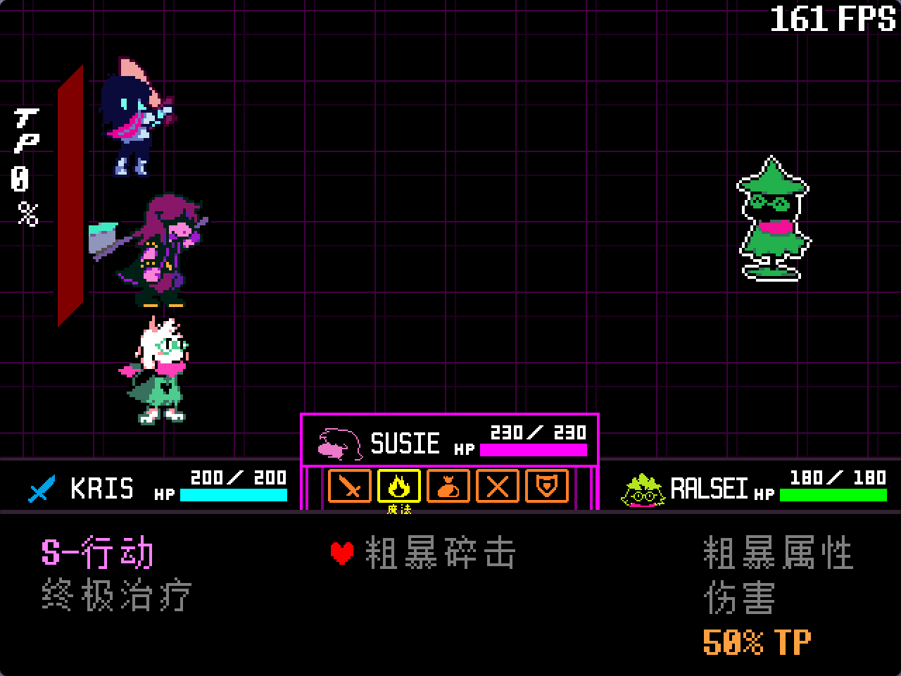
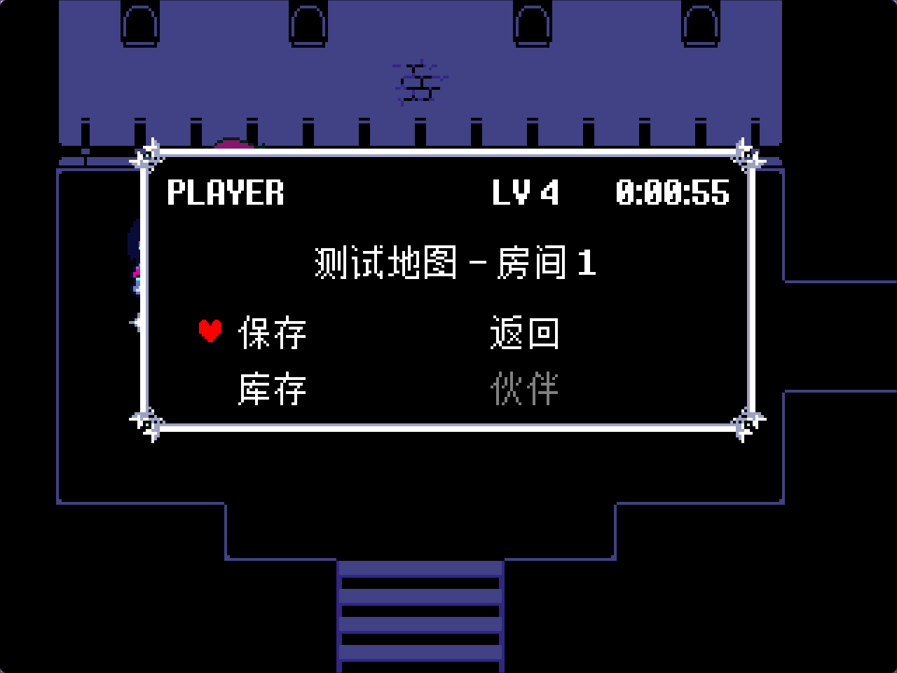
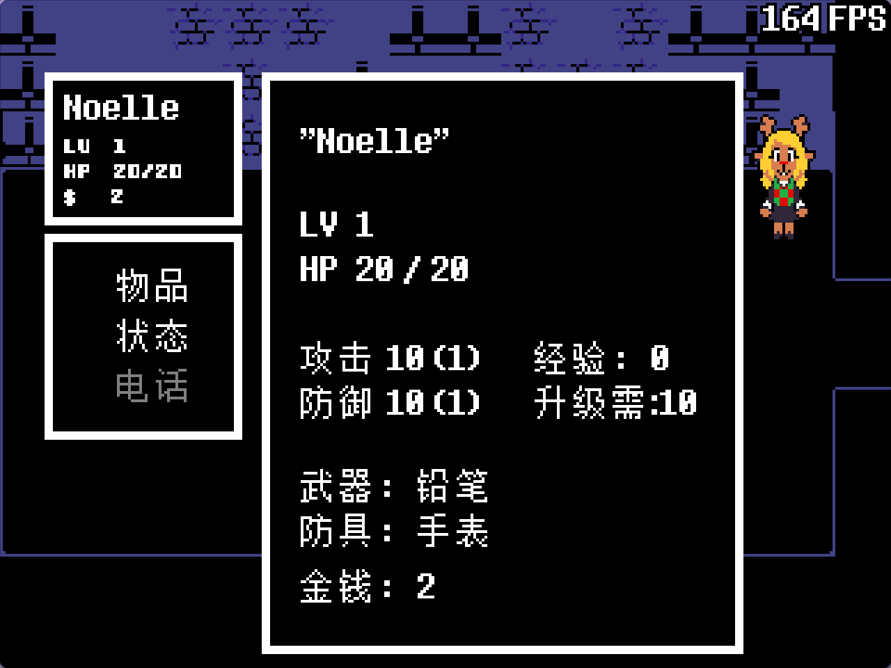

# kristal-i18n-example

[](LICENSE-APACHE)
<br>




<details>
<summary>更多截图（存档页面 / 角色能力 / 调试界面 / 光世界背包）</summary>






</details>

**kristal-i18n-example** — [kristal-i18n](https://github.com/Bli-AIk/kristal-i18n) 的集成测试与演示模组。

本模组把 Kristal `v0.10.0` 模板的所有英文内容都按照 [好人汉化组](https://github.com/gm3dr/) 的翻译进行了汉化，并额外加入了一个光世界场景用于测试光世界对话，用于验证和展示库的各项本地化能力。玩家可以在游戏内的**设置菜单**中切换中英文。

| 简体中文 | English                   |
| -------- | ------------------------- |
| 简体中文 | [English](./README_en.md) |

## 特性

- 🌐 中英双语，设置菜单一键切换
- 📝 文本用 `{id}` 内插本地化：`cutscene:text("{room1.hello}")`
- 🗺️ Tiled NPC / Interactable 的 `text1`/`text2` 属性直接写 `{key}`
- 🏷️ Tiled 地图名通过 `name_id` 属性本地化
- ⚔️ 物品、武器、防具、法术自动 key 化
- 🔤 中文字体 fallback：英文用原版字体，中文回落至 FZBitmap/Unifont

## 依赖

| 库                                                                    | 说明                           |
| --------------------------------------------------------------------- | ------------------------------ |
| [Kristal](https://github.com/KristalTeam/Kristal)                     | 游戏引擎，`v0.10.0` 或更高版本 |
| [kristal-i18n](https://github.com/Bli-AIk/kristal-i18n) | 中文本地化库                   |

## 使用方式

1. 安装 [Kristal](https://github.com/KristalTeam/Kristal) 引擎。
2. 将本仓库克隆到 Kristal 的 `mods/` 目录下，并初始化 submodule：

   ```bash
   cd Kristal/mods
   git clone https://github.com/Bli-AIk/kristal-i18n-example.git
   cd kristal-i18n-example
   git submodule update --init
   ```

3. 启动 Kristal，在模组选择中选择 **kristal-i18n-example**。

## 参考来源

汉化文本以 [好人汉化组（Goodman 3 Localization Group | UNDERTALE & DELTARUNE Chinese Localization）](https://github.com/gm3dr/) 为准。

## 参与贡献

欢迎提交 Issue 或 Pull Request。

## 许可证

本项目采用双许可证授权，您可以选择以下任一许可证：

- Apache License, Version 2.0 ([LICENSE-APACHE](LICENSE-APACHE) 或 http://www.apache.org/licenses/LICENSE-2.0)
- MIT license ([LICENSE-MIT](LICENSE-MIT) 或 http://opensource.org/licenses/MIT)
